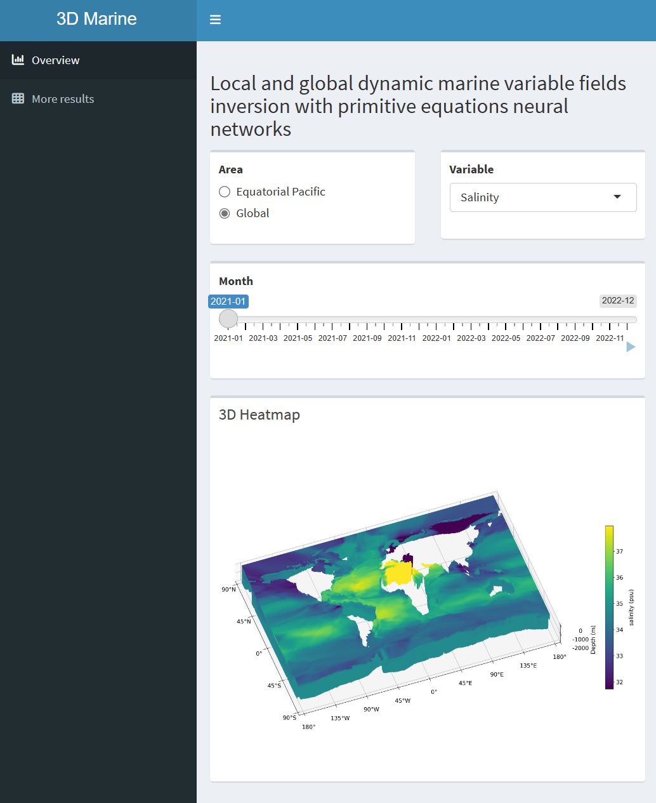

<!-- <span style="color: grey;">_It is better to read in light appearance._</span> -->

<div align="right">
  
<span style="font-size: 12px; font-style: italic; opacity: 0.5;">
  
  _It is better to read in light appearance._
  
</span>

</div>


# Reconstructing and forecasting marine dynamic variable fields across space and time globally and gaplessly


# Abstract

Spatiotemporal projections in marine are crucial for science and society, significantly enhancing the understanding of marine systems, protecting the marine environment, and guiding human activities in the ocean. Previous artificial intelligence (AI) and statistics-based inversion methods, along with numerical forecasting approaches face limitations in leveraging ocean data, generating continuous inversion outputs, and incorporating informative physical constraints. In response to these challenges, we propose the {\color{red}Marine Dynamic Reconstruction and Forecast Neural Networks (MDRF-Net), a mesh-free and easily implementable model designed for the spatial inversion and temporal prediction of ocean temperature-salinity and dynamic fields from Argo and reanalysis data}. This innovative approach enhances interpretability and enables the inversion of variable fields not directly from observed data, i.e., the ocean pressure and density that can reflect fluctuations in ocean transport. MDRF-Net undergoes rigorous spatiotemporal validation and comparison against reanalysis data, demonstrating superior accuracy against other inversion methods. The overall errors for global ocean temperature, salinity, vertical velocity, northward velocity, and eastward velocity fields are 0.455 °C, 0.0714 psu, 4.254×10<sup>-6</sup>m/s, 0.0777 m/s, and 0.0825 m/s, respectively. With its ability to provide contiguous global four-dimensional marine fields, MDRF-Net proves effective in accurately identifying phenomena such as the Mediterranean Salinity Crisis and the North Atlantic Warm Current. More crucially, MDRF-Net could explore challenging-to-observe marine areas like the Arctic zone and forecast oceanic variations for different future timeframe. Thus, MDRF-Net is helping create remarkable effects on Earth's climate and human use of the ocean.

## Keywords

Ocean global dynamics, Fields inversion, Primitive equations, Unobserved marine variables


# Data source and processing

We utilized ocean temperature and salinity data from the Argo project (https://argo.ucsd.edu/) and current reanalysis data from the EU Copernicus ocean service (https://www.copernicus.eu/en).

We found that a convenient way to download Argo data is to use Argo's data visualization tool, EuroArgo Selection Tool (https://dataselection.euro-argo.eu/), and select the csv format. For the EU Copernicus marine service, it is better to use FileZilla to connect to their server and download the relevant nc data files (see Copernicus website for details), which is faster. The dataset we use is 'GLOBAL_ANALYSISFORECAST_PHY_001_024', and the code 'cur' and 'wcur' in it represent the 3D ocean current reanalysis data.

After downloading the data, run the following function in the `Code/LoadData.py` file to process them.

```python
load_data(argo_data_path, argo_save_path, currents_data_path, currents_save_path, r_min, r_max, theta_min, theta_max, phi_min, phi_max, t_min, t_max, trian_vali_test=[8, 1, 1], ratio=1)
```

# Primitive equations neural networks (PENN)


Above is the structure of PENN, run the following function to train the model.

```python
penn(data_path, r_min, r_max, ...)
```


# R Shiny platform

We have integrated all the variable prediction performances across different time and space into an interactive R Shiny platform (https://tikitakatikitaka.shinyapps.io/penn-shiny/). This platform facilitates users to access information about marine variables of interest across different time and spatial dimensions.

