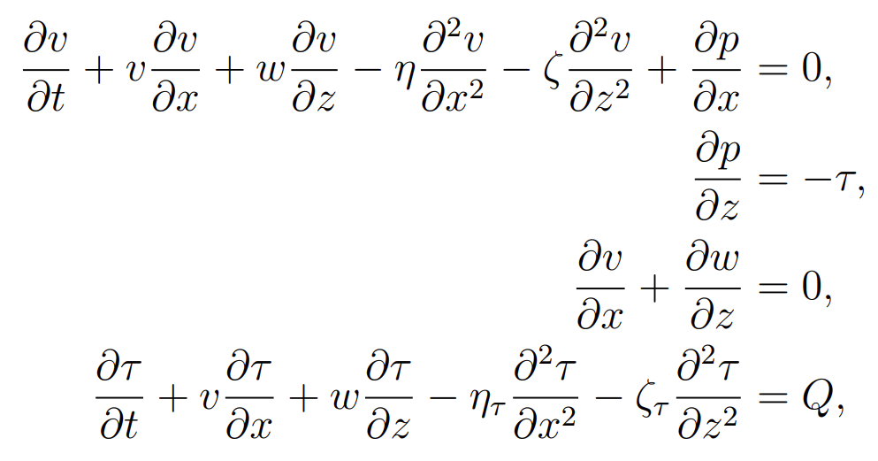
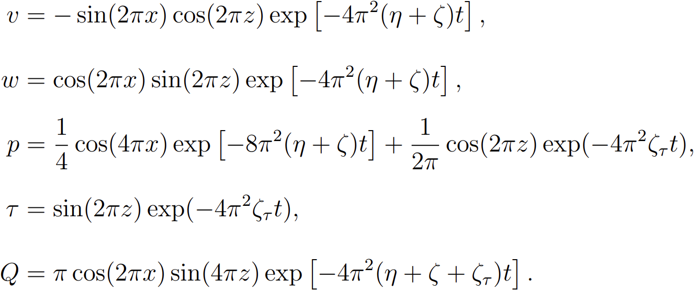

<!-- <span style="color: grey;">_It is better to read in light appearance._</span> -->

<div align="right">
  
<span style="font-size: 12px; font-style: italic; opacity: 0.5;">
  
  _It is better to read in light appearance._
  
</span>

</div>


# Reconstructing and forecasting marine dynamic variable fields across space and time globally and gaplessly
Zhixi Xiong, Yukang Jiang, Wenfang Lu, Xueqin Wang, and Ting Tian


# Abstract

Spatiotemporal projections in marine science are essential for understanding ocean systems and their impact on Earth's climate. 
However, existing AI-based and statistics-based inversion methods face challenges in leveraging ocean data, generating continuous outputs, and incorporating physical constraints. 
We propose the Marine Dynamic Reconstruction and Forecast Neural Networks (MDRF-Net), which integrates marine physical mechanisms and observed data to reconstruct and forecast continuous ocean temperature-salinity and dynamic fields.
MDRF-Net leverages statistical theories and techniques, incorporating parallel neural network sharing initial layer, two-step training strategy, and ensemble methodology, facilitating in exploring challenging marine areas like the Arctic zone. 
We have also theoretically justified the rationality of it by providing an upper bound on its generalization error.
The effectiveness of MDRF-Net's is validated through a comprehensive simulation study, which highlights its capability to reliably estimate unknown parameters.
Comparison with other inversion methods and reanalysis data are also conducted, and the global test RMSE is 0.455°C for temperature and 0.0714psu for salinity.
Bridging the gap between statistics and AI, MDRF-Net effectively learns the ocean dynamics system using physical mechanisms and statistical insights, contributing to a deeper understanding of marine systems and their impact on the environment and human use of the ocean.


## Keywords

Fields inversion | Global ocean dynamics | Primitive equations | Uncollected marine variables


# Marine Dynamic Reconstruction and Forecast Neural Networks (MDRF-Net)


# Simulation Study

We first explore the capabilities of MDRF-Net in a simulated system by considering a 2D simplified version of the primitive equations which has only one dimension in the horizontal direction ($x$) and does not include the diffusion equation for salinity as well as the equation of state. The simplified equations involve four variables: temperature ($\tau$), horizontal velocity ($v$), vertical velocity ($w$), and pressure ($p$). The domain is based on a Cartesian coordinate system and is dimensionless.

The simplified 2D primitive equations are given by:
<p align="center">
  
</p>

where this system admits a specific Taylor-Green vortex solution corresponding to a periodic source term $Q$.

The Taylor-Green vortex solution is as follows:
<p align="center">
  
</p>

The results are presented below, with further details available in our paper.


Run the simulation study:
```
python Simulation.py
```

# Work with Real Data

## Data source and processing

We utilized ocean temperature and salinity data from the Argo project (https://argo.ucsd.edu/) and current reanalysis data from the EU Copernicus ocean service (https://www.copernicus.eu/en).

We found that a convenient way to download Argo data is to use Argo's data visualization tool, EuroArgo Selection Tool (https://dataselection.euro-argo.eu/), and select the csv format. For the EU Copernicus marine service, it is better to use FileZilla to connect to their server and download the relevant nc data files (see Copernicus website for details), which is faster. The dataset we use is 'GLOBAL_ANALYSISFORECAST_PHY_001_024', and the code 'cur' and 'wcur' in it represent the 3D ocean current reanalysis data.

After downloading the data, run the following function in the `Code/LoadData.py` file to process them.

```python
load_data(argo_data_path, argo_save_path, currents_data_path, ...)
```

Parameters explained:
* `argo_data_path` and `argo_data_path`: Path of the raw Argo data and path to save the processed Argo data.
* `currents_data_path` and `currents_data_path`: Path of the raw currents data and path to save the processed currents data.
* `r_min` and `r_max`: The minimum and maximum values of the water depth of the ocean variable fields in meters, e.g., -2000 and 0.
* `theta_min` and `theta_max`: The minimum and maximum values of the latitude of the ocean variable field in degrees, e.g. -20 and 60.
* `phi_min` and `phi_max`: The minimum and maximum values of the longitude of the ocean variable field in degrees, e.g. -120 and 170.
* `t_min` and `t_max`: Minimum and maximum values of the ocean variable field time in the following format 'YYYY-MM-DDTHH:MM:SSZ', e.g. '2021-05-18T05:42:37Z'.
* `train_vali_test`: The ratio of the training set, validation set, and test set, e.g. [8, 1, 1].

## Train MDRF-Net

Above is the structure of MDRF-Net, run the following function to train the model.

```python
mdrf_net(data_path, r_min, r_max, ...)
```

Parameters explained:
* `data_path`: Path to data storage.
* `r_min` and `r_max`: The minimum and maximum values of the water depth of the ocean variable fields in meters, e.g., -2000 and 0.
* `theta_min` and `theta_max`: The minimum and maximum values of the latitude of the ocean variable field in degrees, e.g. -20 and 60.
* `phi_min` and `phi_max`: The minimum and maximum values of the longitude of the ocean variable field in degrees, e.g. -120 and 170.
* `t_min` and `t_max`: Minimum and maximum values of the ocean variable field time in the following format 'YYYY-MM-DDTHH:MM:SSZ', e.g. '2021-05-18T05:42:37Z'.
* `r_num`, `theta_num` and `phi_num`: The density of sampling points used for calculating equation errors across water depth, latitude, and longitude.
* `batch_size`: The batch size for each variable's observed data points.
* `init_beta_tau` and `init_beta_sigma`: The initial values of the parameters $\beta_\tau$ and $\beta_\sigma$ in the primitive equations.
* `num_domain` and `num_boundary`: The number of sampling points on the domain and along the boundary used for computing the equation error.
* `input_output_size` The number of inputs and outputs of the network.
* `n_layers`: Each parallel subnet's number of layers.
* `activation`: Activation function.
* `initializer`: Parameters initialize method.
* `model_save_path_1` and `model_save_path_2`: The storage paths for models in the two training phases.
* `variable_save_path`: The storage path for the model's unknown parameters.
* `save_period`: The storage interval for the model and its parameters, measured in iterations.
* `resample_period_1` and `resample_period_2`: The resampling interval for observational data and sampling points, measured in iterations.
* `num_iter_1` and `num_iter_2`: The total number of iterations for each stage in the two-stage training separately.
* `optimizer`: Optimization algorithm.
* `learning_rate_1` and `learning_rate_2`: The initial learning rates for the two training stages.
* `loss_weights_1` and `loss_weights_2`: The internal weights of the loss function for the two training stages.


# R Shiny platform

We have integrated all the variable prediction performances across different time and space into an interactive R Shiny platform (https://tikitakatikitaka.shinyapps.io/mdrf-net-shiny/). This platform facilitates users to access information about marine variables of interest across different time and spatial dimensions.

